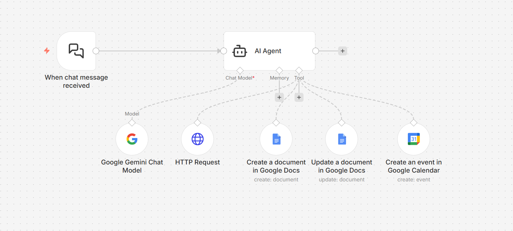

# 🧠 n8n-taskGenie-workflow

A conversational AI agent that executes real productivity tasks such as document creation, calendar scheduling, and API-based actions using natural language.

---

## 🎯 Problem Statement
Switching between chat tools, documents, and calendars reduces productivity and increases manual effort.

---

## 💡 Solution
This workflow enables a chat-driven AI agent to interpret user intent and execute actions across multiple productivity tools.

---

## 🔄 Workflow Logic
1. 💬 Chat trigger receives user input
2. 🧠 AI agent interprets intent
3. 🛠️ Agent dynamically selects tools:
   - 📄 Create or update documents
   - 📅 Schedule calendar events
   - 🌐 Fetch external data
4. 📩 Results are returned conversationally

---

## 🛠️ Tools & Integrations
- ⚙️ n8n
- 🤖 AI Agent framework
- 🧠 Google Gemini Chat Model
- 📄 Google Docs API
- 📅 Google Calendar API
- 🌐 HTTP APIs

---

## 🌟 Key Highlights
- 🛠️ Tool-using AI agent architecture
- 🗣️ Natural language to action execution
- 🔁 Highly extensible design
- 💼 Real-world productivity automation

---

## 📸 Workflow Preview

---

## 🔐 Notes
> This workflow is demonstrated using **generic resources and sanitized credentials**.
